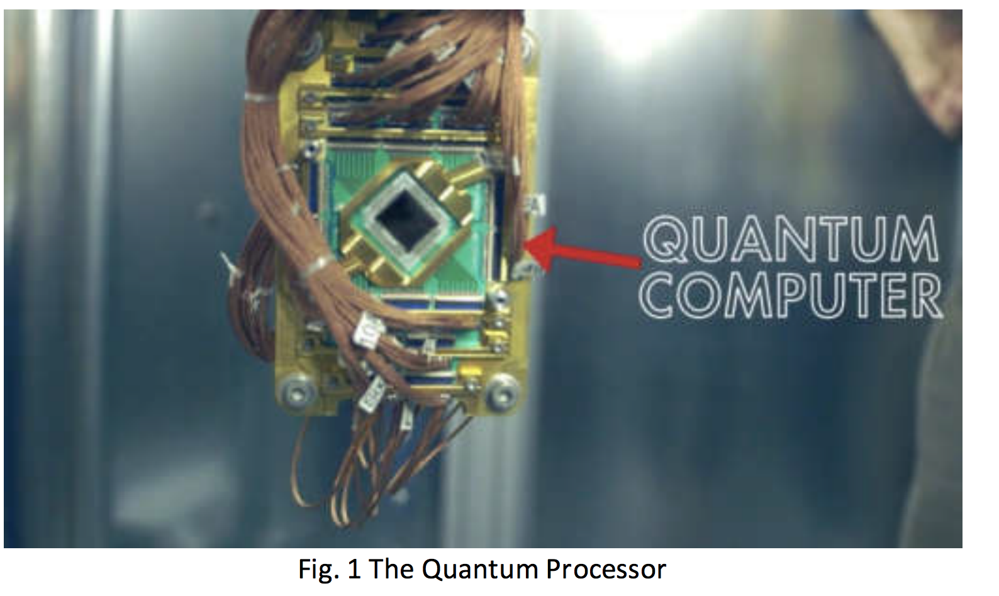
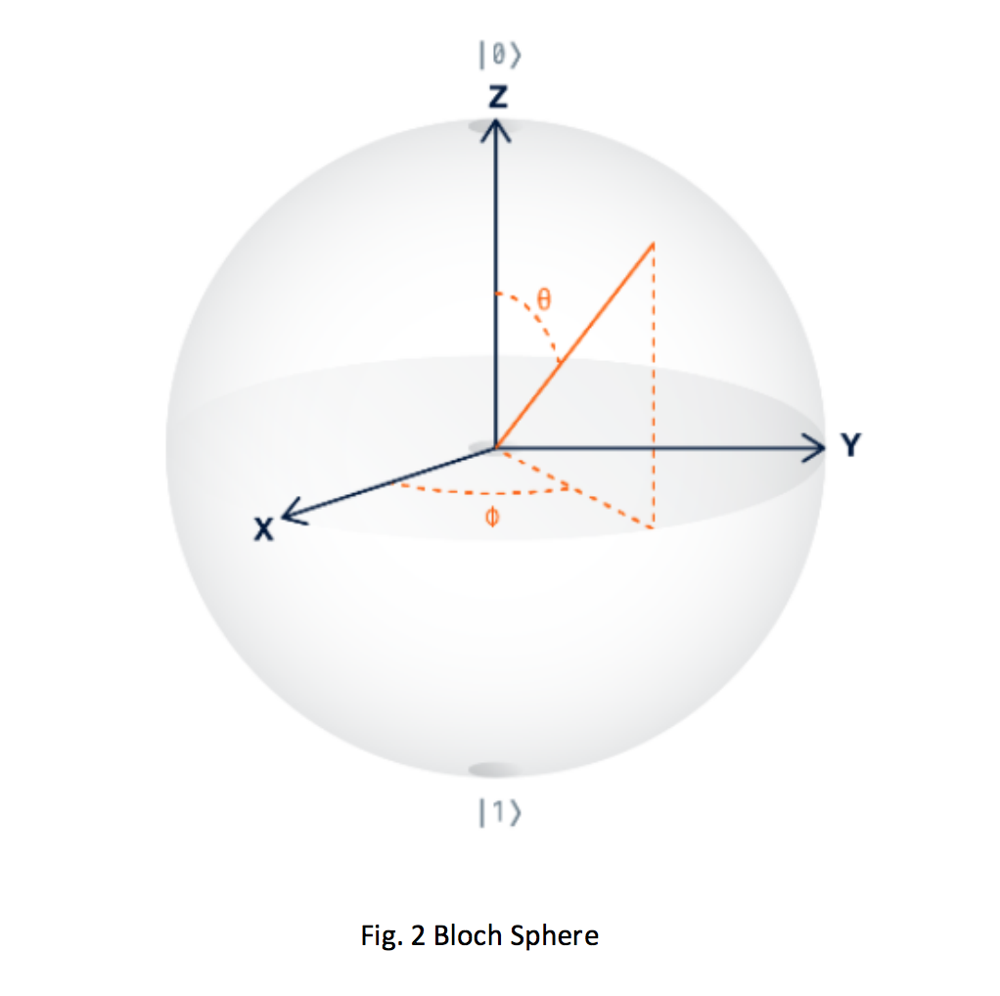
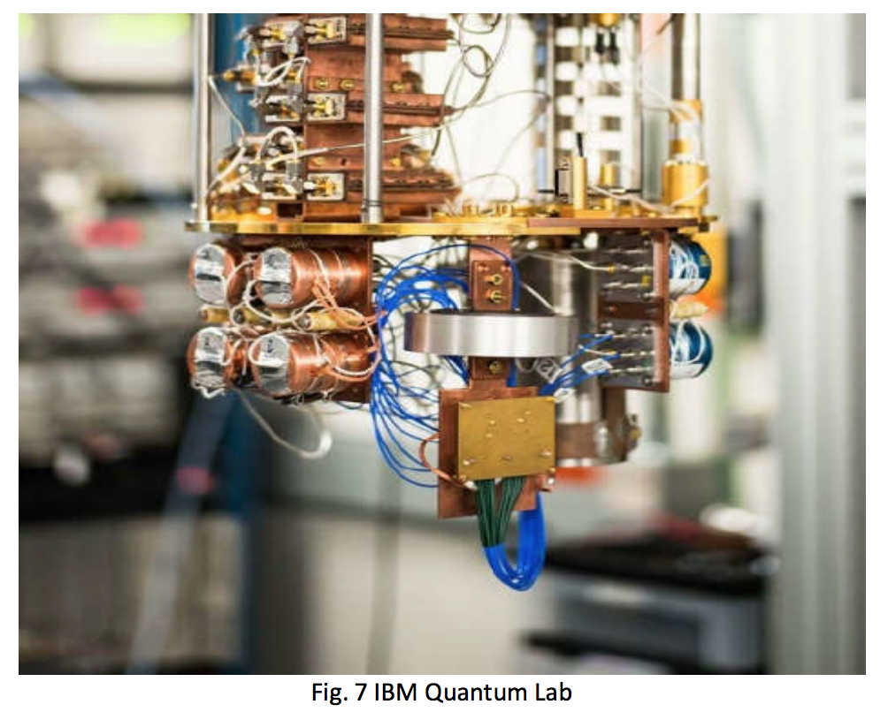
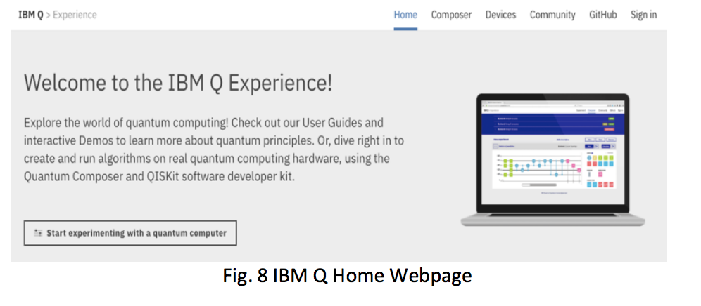
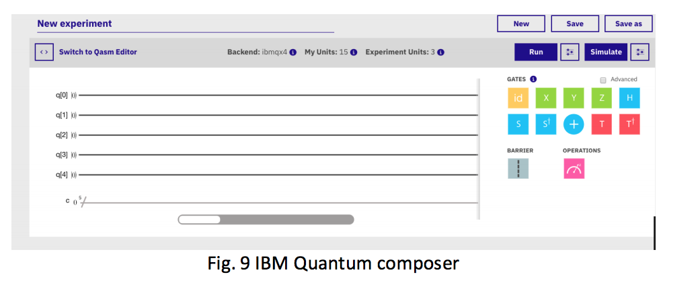
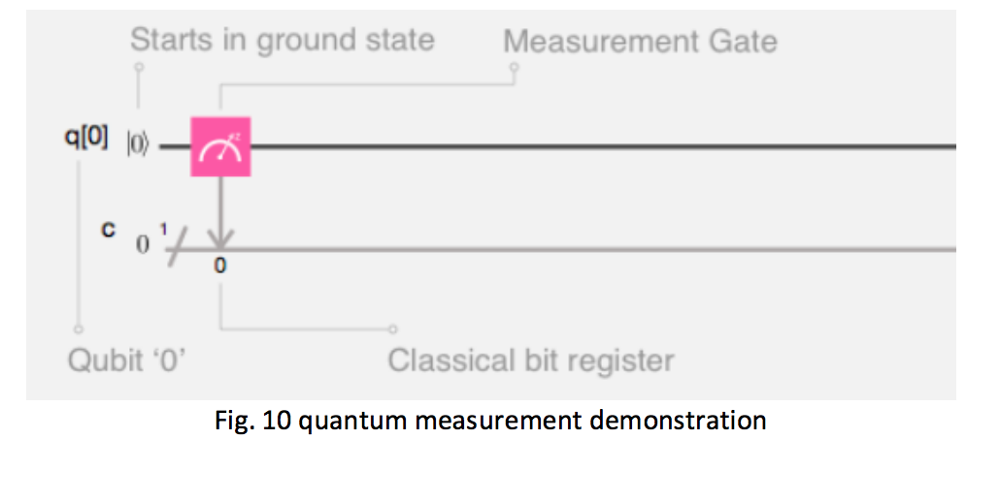
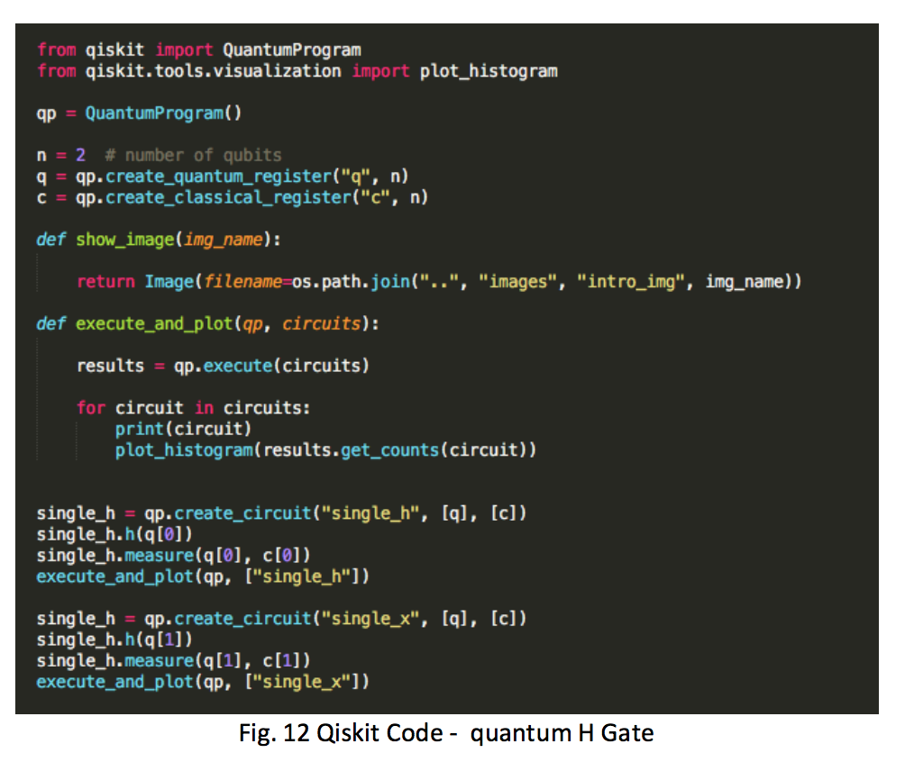
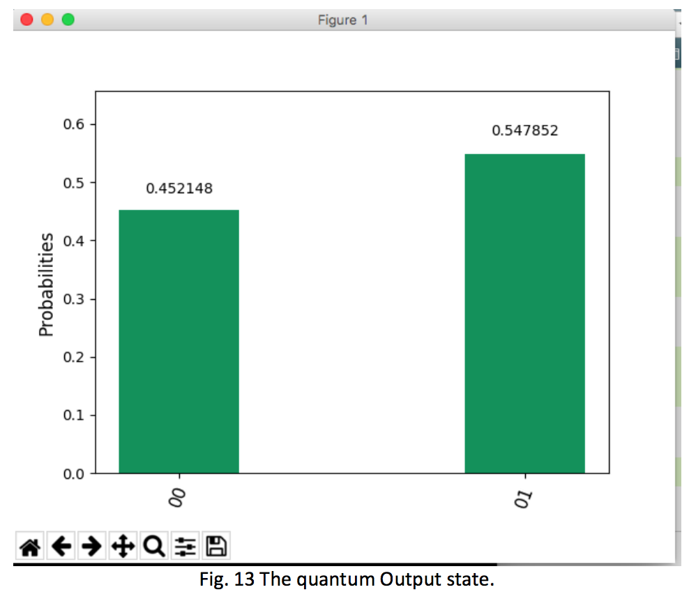

# Qiskit_Demo

## IBM Quantum Experience Analysis Using QISKit Software Development Kit

* Presented by :
* Levent Ertaul, Harkirat Singh
* California State University East Bay, Hayward, CA, USA
* levent.ertaul@csueastbay.edu, hsingh24@horizon.csueastbay.edu

# Introduction:

Quantum computer systems are potentially efficient machines that adopt a revolutionary method for handling raw bits of data used in conventional computers. Quantum Computing is a research discipline at its outset, like the old days when a person tried to program code without having the capability to run or simulate it virtually on a real computer. [6]  
The current state of this subject suggests that it is nonetheless a long way from being in the scope of researchers' hand at a large scale, because of the physical or laboratory technology is based upon [10]. Actual experiments are limited to some research institutes and industrial companies who have invested in building actual quantum processors in the surroundings essential to apply quantum physics interactions. However, many quantum developments are undergoing and possible enhancement from a researcher's point of view through exploring distinct programs and developing suitable algorithms. [8]  
Earlier in 2017, IBM made an entirely functional, five-qubit quantum computer available to the public via the world wide web. The architecture rest with five transmon qubits in a star geometry and a complete Clifford algebra is available. The system is free to use through IBM's cloud, and several experiments have already been published, such as a demonstration of quantum teleportation [21], easy quantum state tomography [20] and the experimental test of Mermin inequalities.

# Basic Idea 
A quantum processor primarily consists of particles and information that appear in specific physical nature while subjected to certain physical conditions.


The Bloch sphere is a depiction of a qubit (quantum bit), the primary building block of quantum computers. Picturing a qubit requires a one of a kind tool called the Bloch Sphere. The Sphere is the delineation of qubit state with a radius and a point on its surface depicts the qubit's state. Like a globe with longitude and latitude to portray focuses on its surface, the Bloch sphere has edges to angles to the specific condition of a qubit. This depiction permits any qubit state, incorporating those with complex coefficients, to be portrayed as a point on the surface of the Bloch sphere. Focuses on the surface of the IBM Quantum Experience Analysis Using QISKit Software Development Kit 2 Bloch circle which lie along the X, Y, or Z axis relate to distinct states as depicted beneath.



Qubits are composed of controlled particles and the means for control (e.g., gadgets that trap particles and change them from one state to another). A qubit is the quantum form of a bit, and its quantum state can take values of |0>, |1>, or both at once, a phenomenon known as superposition. The half angle bracket notation |> is traditionally used to recognize qubits. [15] Doing any complex calculation with just one qubit is difficult. Like traditional computers, quantum computers utilize quantum registers made up of multiple qubits. Whenever collapsed, quantum registers are bit strings whose length decides the measure of data they can store. In superposition, each qubit in the register is in a superposition of |1〉 and |0〉, and thus a register of n qubits is in a superposition of every one of the 2n possible bit strings that can be represented to utilizing n bits. [16]


# IBM's Quantum Experience 

In May 2016 IBM made a global quantum computer available to the public through the IBM cloud [1, 8], housed on the IBM T.J. Watson research middle in New York [8]. Currently, IBM Quantum experience consists of five transmon qubits which are connected in a star geometry. Mainly, it has a full Clifford algebra [12,32], except for CNOT gate's execution at the core qubit with any of the four external qubits. Programming the quantum computer is simply provided through a graphical user interface, which IBM dubbed the composer. [22] The interface is so reachable and operational that now any undergraduate scholar can perform experiments on a real-existence quantum computer. However, the system is strong enough to also allow research experiments, and particularly the demonstration of quantum superposition and entanglement [26]. IBM Quantum Experience calibrates every  3 day, and commonly its temperature is around a few mK and the decoherence times of the single qubits are about 50-100 micro sec. However, it needs to be emphasized that a shortcoming of Quantum experience is that best projective measurements of the single qubit states in z -route qubits can be achieved, i.e., it could be measured whether the single qubits are |↑〉or |↓〉. No quantum tomography for the collective state is possible, which means that no direct measures of correlations between qubits can be implemented. [13,14]



# IBM-Q ACCOUNT SETUP

The IBM Q account access can be set up by signing up on the quantum experience website. The access is available to all users. However, the general user is restricted to use the 15 credits equal to use of 15 qubits. For example, the use of IBMQX5 is 5 qubits. The user has the option to run the experiment as a live experiment or to run a simulation. The live run with get your project in the IBM-Q lab, and the user gets the email with results. On the other hand, the user can also opt to run the experiment using the simulation, which uses the cache data. [22]



# IBM Composer 

The IBM Quantum Composer is a graphical user interface for programming a quantum processor. Consider it as a device to assemble quantum algorithms the usage of a library of properlydefined measurements and gates (operations that alternate the state of the qubit).



The IBM-Q Composer enables you to create a quantum score - not a score as in a carrying match, but as a substitute inside the musical feel. In a quantum score, just as with music, time progresses from left to right. Every line represents a qubit (as well as what occurs to that qubit over time). just as with musical notes, each qubit has a unique frequency. A quantum algorithm (circuit) starts off evolved by preparing the qubits in properly-defined states (as an instance state |0⟩), then executing a chain of single or two-qubit gates in time from left to right. [22] Within the below example, we created a single-qubit evaluation with one classical bit within the classical bit register. We measured Qubit 0 and stored the dimension bring about the 0th position of the classical bit register (that is the road below the rating categorized 'c').



# QISKit

QISKit is a Python software development kit (SDK) that user can use to create their quantum computing programs based on circuits described via the OpenQASM 2.0 specification, compile them, and execute them on numerous IBM backends (real quantum processors online, simulators online, and simulators on local). For the online backends, QISKit makes use of user’s python API connector to the IBM Q system to connect and accomplish the task. [2]

## Getting started with QISKit SDK

The qiskit installation can be done using the command in Terminal 

```
pip install qiskit
```
The python 3.5 version is required. [17]

## basic Concept

The simple concept of qiskit quantum program is an array of quantum circuits. The program workflow consists of 3 levels: 

* build,
* compile, 
* Run. 

Build permits user to make exceptional quantum circuits that constitute the trouble you are fixing; compile permits you to rewrite them to run on distinct backends (simulators/actual chips of various quantum volumes, sizes, constancy, and so on.); and Run launches the roles. The data gather's after Run launches the roles. There are strategies for putting this data together, depending on the program. Doing so offers the solution to make a better program for the next instance. [9]

## Building your quantum program using Qiskit SDK.

QISKit is useful putting the quantum circuits, and quantum
gates as a substitute placing the gates manually in IBM Q
composer and help in dealing with complex circuits, loops, and
if-else condition. The one-time connection is required to set up
with the local host and the IBM Q with the usage of API token.
[4]
Demonstrating the basic gates definition in the usage of the
qiskit import. The results are equal to defining and ruining the 
5
experiments in the IBM-Q composer. [2]
the use of the QISKIT the API token needs to be set once and
suggests the results same as running live in an IBM-Q
composer.





# Conclusion 

In this paper, we have discussed the IBM Q and Its free access to use the quantum computers and helping the industry to grow to make the quantum features available in many applications. The user is leveraging quantum features on their existing computers without the need to purchase the expensive real quantum computer. The IBM based tool QISKit is the free open source tool easily imported into any machine is available to any users for the quantum programs. The quantum computers have the potential to run fast algorithms with fewer attempts that might result to shake the network security industry as the most crypto keys are easy to break with quantum computers. The quantum processors are still not available to users to their maximum extent.
